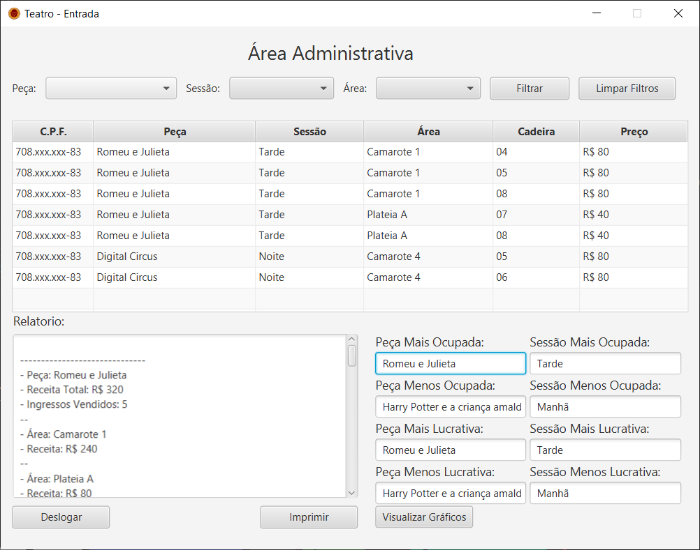

# TeatroABC

Aplicativo desktop em Java para gerenciar a venda e compra de ingressos de um teatro. A interface é construída com JavaFX (FXML).

## O que é este projeto

- Sistema simples de gerenciamento de ingressos para um teatro.
- Permite gerenciar áreas, cadeiras, usuários e vendas (compra/visualização) através de uma interface gráfica JavaFX.
- Os dados de usuários estão em `src/main/resources/br/eng/dgjl/teatro/usuarios.json` e as views FXML em `src/main/resources/br/eng/dgjl/teatro/ui`.

## Utilização
- No menu inicial é possivel realizar o cadastro e/ou login.


### Admin
- Caso seja utilizado o login de admin
- Configurado em `usuarios.json` como `CPF:ADMIN, senha:a`


- A interface admininstrativa permite também a geração de gráficos.


### Usuario
- Caso seja utilizado o login de um usuário:


- Após realizar a filtragem de peça, sessão, área:


- Após selecionar as poltronas e clicar em "Comprar"
- O "OK" (azul) confirma a compra e o "Cancelar" anula.


- O botão "Histórico de Compras" do usuário.


## Requisitos

- Java JDK 21.
- Variável de ambiente `JAVA_HOME` apontando para o JDK 21.

Observação: o projeto já inclui dependências JavaFX no `pom.xml` e o `javafx-maven-plugin` para facilitar a execução.

## Como executar (Windows)

1. Abra o powershell na raiz do projeto (onde está o `pom.xml`).
2. Adicione o JAVA_HOME como variavel de ambiente
```powershell
$env:JAVA_HOME = 'C:\Caminho\Do\Java\...\jdk-21'
```
3. Rode o comando abaixo para executar a aplicação diretamente:
```powershell
.\mvnw.cmd clean javafx:run
```

## Executar pelo IntelliJ IDEA

- No gerenciador de projetos IntelliJ utilize o botão de abrir pasta e selecione o diretório raiz (onde está o `pom.xml`).
- O Intellij cuidará da versão do JDK e das dependências.
- Execute a classe `br.eng.dgjl.teatro.Main`.

## Estrutura útil do projeto

- `src/main/java/br/eng/dgjl/teatro` — código fonte Java (controllers, classes de domínio, utilitários).
  - `classes/` — modelos e utilitários (por exemplo `Ingresso.java`, `Usuario.java`, `Peca.java`).
  - `ui/` — controladores e menus JavaFX (`StartupController`, `CompraController`, `AdminController`, etc.).
- `src/main/resources/br/eng/dgjl/teatro` — recursos embarcados.
  - `ui/` — arquivos FXML usados pela interface (`StartupView.fxml`, `CompraView.fxml`, etc.).
  - `usuarios.json` — arquivo de dados de exemplo para usuários.